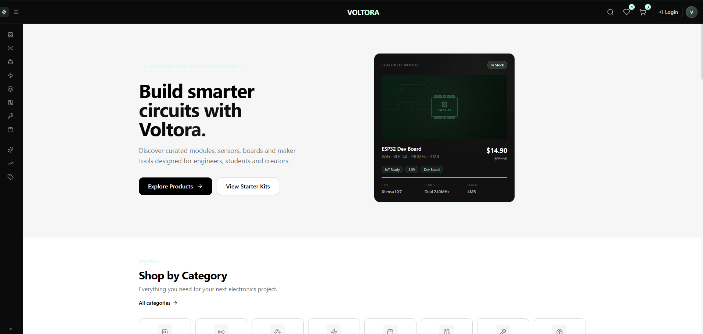
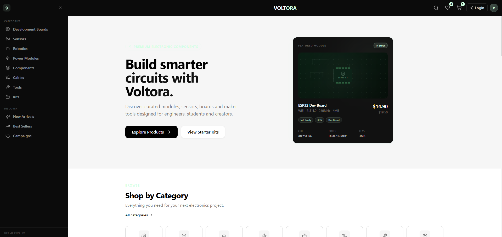
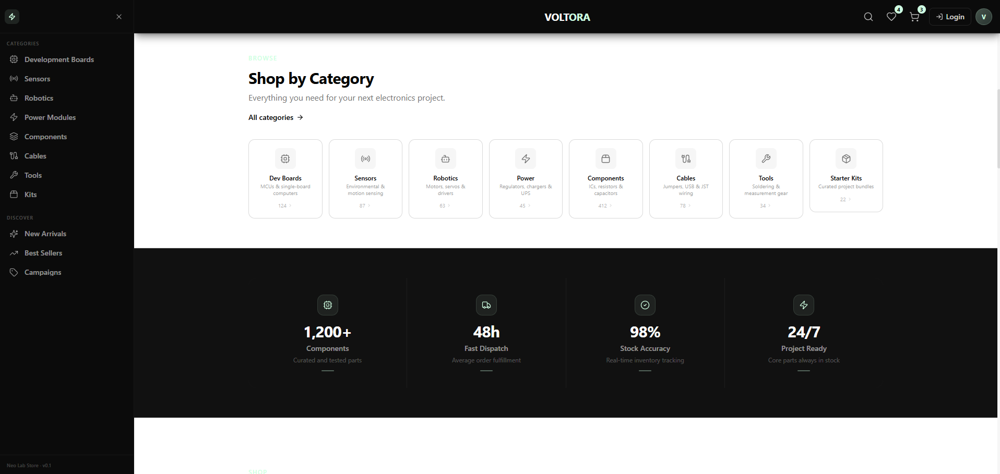
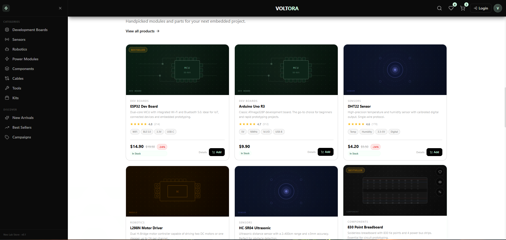
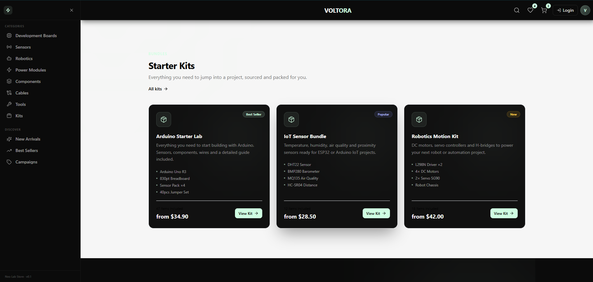
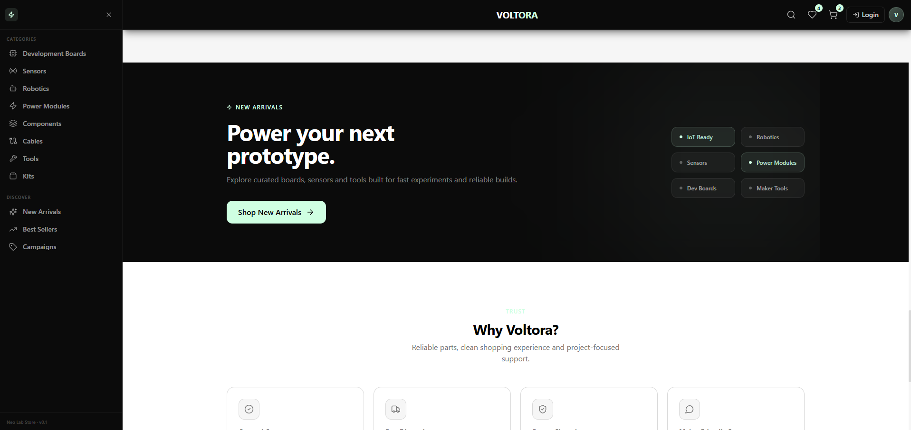
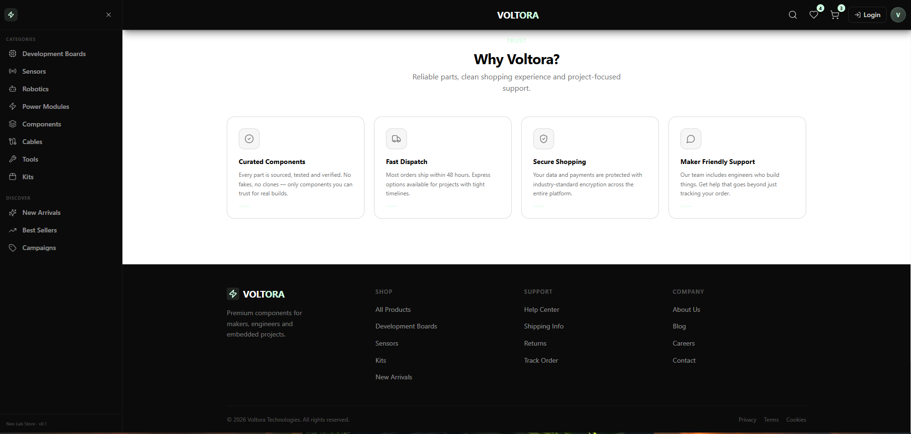
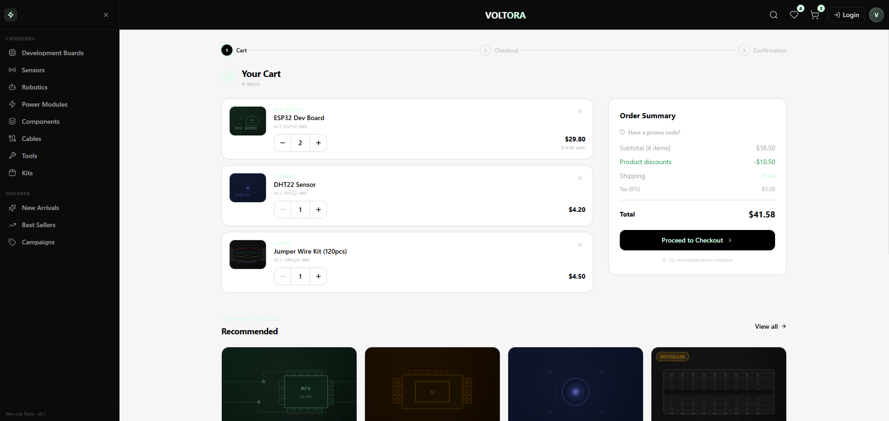
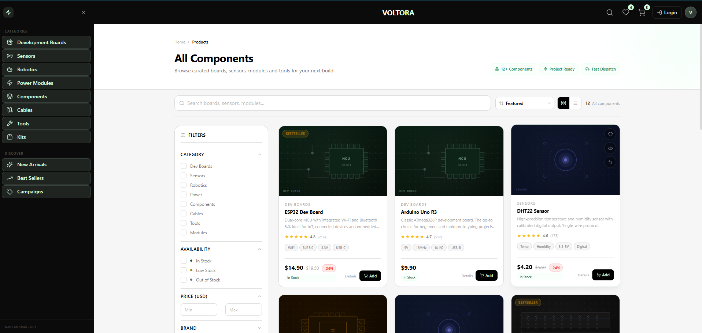

# Voltora

<div align="center">



<br />


### Premium electronic components e-commerce UI built with React, TypeScript and Tailwind CSS.

Voltora is a modern **Neo Lab Store** concept for selling electronic components, development boards, sensors, robotics parts, power modules and maker kits. The current version focuses on a complete frontend experience with mock data, polished UI flows and Firebase-ready architecture.

</div>

---

## Table of Contents

- [Overview](#overview)
- [Screenshots](#screenshots)
- [Core Features](#core-features)
- [Tech Stack](#tech-stack)
- [Design System](#design-system)
- [Pages and Routes](#pages-and-routes)
- [Project Structure](#project-structure)
- [Getting Started](#getting-started)
- [Environment Variables](#environment-variables)
- [Available Scripts](#available-scripts)
- [Data Model Preview](#data-model-preview)
- [Frontend Status](#frontend-status)
- [Firebase Roadmap](#firebase-roadmap)
- [Quality Checklist](#quality-checklist)
- [Author](#author)

---

## Overview

**Voltora** is designed as a premium e-commerce interface for electronics and embedded systems products. It combines a clean shopping experience with a technical product presentation style, making it suitable for makers, engineering students, embedded developers and robotics enthusiasts.

The visual direction is called **Neo Lab Store**:

- Strong black navigation surfaces
- Soft mint highlights
- Clean light content areas
- Technical product cards
- Responsive product listing
- Smooth micro interactions
- Modern cart, wishlist, checkout and auth mock flows

Current project status:

> Frontend UI is complete with mock data and mock flows. Firebase backend integration is planned as the next phase.

---

## Screenshots

### Home Hero


### Expanded Sidebar



### Categories and Lab Stats



### Featured Products



### Starter Kits



### Promo Banner and Trust Section



### Footer



### Cart Page



### Products Listing Page



---

## Core Features

### 1. Premium Storefront

- Hero section with premium product preview card
- Category cards for electronic component families
- Featured components showcase
- Starter kit section for bundled project solutions
- Promo banner for new arrivals
- Trust cards for confidence and support
- Fully responsive layout

### 2. Collapsible Sidebar Navigation

- Compact icon-only mode
- Expanded category navigation
- Smooth open and close behavior
- Category and discovery groups
- Active and hover states with mint accents
- Mobile-friendly navigation behavior

### 3. Product Listing Experience

- Product grid view
- Product list view support
- Search input
- Category filters
- Availability filters
- Price range filters
- Brand filters
- Product tags and rating filters
- Sort controls
- Active filter chips
- Mobile filter drawer

### 4. Product Cards

- Abstract CSS-based product visuals
- Product category, title and description
- Rating and review count
- Technical chips
- Stock badge
- Price, old price and discount badge
- Add to cart button
- Details link
- Quick actions for wishlist, quick view and compare

### 5. Product Detail Page

- Product breadcrumb
- Product gallery with abstract visuals
- Sticky purchase panel
- Quantity selector
- Product specs chips
- Overview, specifications, applications and package tabs
- Datasheet card UI
- Shipping and trust information
- Related products

### 6. Cart, Wishlist and Checkout Mock UI

- Cart page with item cards
- Quantity controls
- Order summary
- Recommended products
- Wishlist page
- Checkout mock flow
- Contact, shipping, payment and review steps
- Mock success screen

### 7. Auth and Profile UI

- Login page
- Register page
- Forgot password page
- Password visibility toggle
- Mock social auth buttons
- Profile dashboard
- Orders page
- Settings page
- Saved addresses and profile cards

### 8. Motion and Micro Interactions

- Page transitions
- Reveal animations
- Staggered product grid appearance
- Hover glow effects
- Toast feedback
- Loader and skeleton polish
- Reduced motion support

---

## Tech Stack

| Technology | Purpose |
|---|---|
| React | Component-based UI |
| TypeScript | Type-safe frontend development |
| Vite | Fast development and build tooling |
| Tailwind CSS | Utility-first styling |
| React Router DOM | Client-side routing |
| Framer Motion | Page transitions and micro interactions |
| Lucide React | Icon system |
| Firebase | Planned backend, auth, database and storage layer |

---

## Design System

### Color Palette

| Token | Hex | Usage |
|---|---:|---|
| Black | `#000000` | Navbar, sidebar, strong CTA |
| Mint | `#CFFFE2` | Primary highlight, CTA, focus ring |
| Soft Mint | `#A2D5C6` | Borders, badges, icon accents |
| Light Background | `#F6F6F6` | Main page background |
| Soft Black | `#0B0B0B` | Dark surfaces |
| Dark Surface | `#111111` | Cards, promo sections |
| Dark Hover | `#1A1A1A` | Sidebar and menu hover |
| Muted Text | `#737373` | Secondary text |
| Soft Border | `#D9D9D9` | Card and input borders |
| Very Light Mint | `#E9FFF2` | Soft highlight backgrounds |

### UI Principles

- Use mint as an accent, not as the main surface.
- Keep product cards technical but readable.
- Make primary actions obvious.
- Keep dark areas premium and controlled.
- Avoid heavy neon effects.
- Favor calm transitions over playful motion.
- Make the UI usable with keyboard navigation.
- Keep mobile layouts clean and thumb-friendly.

### Component Families

```txt
components/
  ui/
    Button
    Card
    Badge
    Input
    SearchInput
    Dropdown
    Drawer
    Modal
    Skeleton
    EmptyState
    SectionHeader
    QuantitySelector
    Tooltip
    Loader
    Toast

  layout/
    MainLayout
    Navbar
    Sidebar
    Footer

  product/
    ProductCard
    ProductGrid
    ProductVisual
    ProductRating
    ProductPrice
    ProductStockBadge
    ProductQuickActions
    ProductSpecsChips

  products/
    ProductsHeader
    ProductsToolbar
    ProductsFilterPanel
    ProductsMobileFilters
    ProductsActiveFilters
    ProductsSortSelect
    ProductsViewToggle
    ProductsResultSummary

  product-detail/
    ProductBreadcrumb
    ProductGallery
    ProductPurchasePanel
    ProductInfoTabs
    ProductSpecsTable
    ProductDatasheetCard
    ProductShippingInfo
    ProductTrustBadges
    RelatedProducts

  cart/
  wishlist/
  checkout/
  auth/
  profile/
  motion/
```

---

## Pages and Routes

| Route | Page | Status |
|---|---|---|
| `/` | Home page | Complete |
| `/products` | Product listing, filters and grid | Complete |
| `/products/:slug` | Product detail page | Complete |
| `/cart` | Cart page | Mock UI complete |
| `/wishlist` | Wishlist page | Mock UI complete |
| `/checkout` | Checkout mock flow | Mock UI complete |
| `/login` | Login page | Mock UI complete |
| `/register` | Register page | Mock UI complete |
| `/forgot-password` | Forgot password page | Mock UI complete |
| `/profile` | Profile dashboard | Mock UI complete |
| `/orders` | Orders page | Mock UI complete |
| `/settings` | Settings page | Mock UI complete |
| `*` | 404 page | Complete |

---

## Project Structure

```txt
voltora/
  public/

  src/
    app/
      App.tsx
      router.tsx

    components/
      auth/
      cart/
      checkout/
      home/
      layout/
      motion/
      product/
      product-detail/
      products/
      profile/
      ui/
      wishlist/

    data/
      home.ts
      mockCart.ts
      mockOrders.ts
      mockProducts.ts
      mockUser.ts
      mockWishlist.ts
      navigation.ts

    hooks/
      useMockAuth.ts
      useMockCart.ts
      useMockWishlist.ts
      usePrefersReducedMotion.ts
      useProductFilters.ts
      useSidebar.ts
      useToast.ts

    lib/
      cn.ts

    pages/
      CartPage.tsx
      CheckoutPage.tsx
      ForgotPasswordPage.tsx
      HomePage.tsx
      LoginPage.tsx
      NotFoundPage.tsx
      OrdersPage.tsx
      ProductDetailPage.tsx
      ProductsPage.tsx
      ProfilePage.tsx
      RegisterPage.tsx
      SettingsPage.tsx
      WishlistPage.tsx

    styles/
      index.css
      motion.css

    types/
      auth.ts
      cart.ts
      checkout.ts
      filters.ts
      home.ts
      navigation.ts
      order.ts
      product.ts
      ui.ts
      user.ts

    utils/
      productFilters.ts

  docs/
    images/

  package.json
  tailwind.config.ts
  tsconfig.json
  vite.config.ts
  README.md
```

---

## Getting Started

### Prerequisites

Make sure you have the following installed:

- Node.js 18 or newer
- npm, pnpm or yarn
- Git

### Installation

```bash
git clone https://github.com/akinbs/voltora.git
cd voltora
npm install
```

### Run Development Server

```bash
npm run dev
```

The project will usually run at:

```bash
http://localhost:5173
```

### Build for Production

```bash
npm run build
```

### Preview Production Build

```bash
npm run preview
```

---

## Environment Variables

Firebase is planned for the backend phase. When Firebase integration starts, create a `.env` file in the project root.

```env
VITE_FIREBASE_API_KEY=
VITE_FIREBASE_AUTH_DOMAIN=
VITE_FIREBASE_PROJECT_ID=
VITE_FIREBASE_STORAGE_BUCKET=
VITE_FIREBASE_MESSAGING_SENDER_ID=
VITE_FIREBASE_APP_ID=
```

> Current version uses mock data and mock hooks. No real Firebase connection is required yet.

---

## Available Scripts

| Script | Description |
|---|---|
| `npm run dev` | Starts the Vite development server |
| `npm run build` | Builds the app for production |
| `npm run preview` | Previews the production build locally |
| `npm run lint` | Runs lint checks, if configured |

---

## Data Model Preview

### Product

```ts
export type Product = {
  id: string;
  name: string;
  slug: string;
  category: string;
  description: string;
  price: number;
  oldPrice?: number;
  currency: "USD" | "TRY";
  rating: number;
  reviewCount: number;
  stock: number;
  stockStatus: "in-stock" | "low-stock" | "out-of-stock";
  badges: ProductBadge[];
  specs: ProductSpec[];
  visualType: ProductVisualType;
  featured?: boolean;
  isNew?: boolean;
  isBestSeller?: boolean;
  discountPercentage?: number;
  sku: string;
  brand?: string;
};
```

### Cart Item

```ts
export type CartItem = {
  id: string;
  productId: string;
  name: string;
  slug: string;
  category: string;
  price: number;
  oldPrice?: number;
  currency: "USD" | "TRY";
  quantity: number;
  stock: number;
  stockStatus: "in-stock" | "low-stock" | "out-of-stock";
  sku: string;
  brand?: string;
};
```

### Mock User

```ts
export type MockUser = {
  id: string;
  fullName: string;
  email: string;
  role: "customer" | "admin";
  avatarInitials: string;
  createdAt: string;
  phone?: string;
  company?: string;
  location?: string;
  preferredCurrency: "USD" | "TRY";
};
```

---

## Frontend Status

| Area | Status |
|---|---|
| Layout | Complete |
| Home page | Complete |
| Product listing | Complete |
| Product detail | Complete |
| Cart UI | Complete |
| Wishlist UI | Complete |
| Checkout mock | Complete |
| Auth UI | Complete |
| Profile dashboard | Complete |
| Motion polish | Complete |
| Responsive cleanup | Complete |
| Firebase integration | Planned |
| Admin panel | Planned |
| Real payment | Planned |

---

## Firebase Roadmap

The next development phase will connect Voltora to Firebase.

### Phase 1: Firebase Setup

- Create Firebase project
- Add Firebase config
- Configure environment variables
- Create Firebase client service

### Phase 2: Authentication

- Email and password login
- Register
- Logout
- Password reset
- Protected routes
- User profile document creation

### Phase 3: Firestore Database

Planned collections:

```txt
users
products
categories
carts
wishlists
orders
reviews
```

### Phase 4: Firebase Storage

- Product image upload
- Category images
- User avatar upload
- Datasheet PDF storage

### Phase 5: Admin Panel

- Product create, edit and delete
- Category management
- Order management
- Stock updates
- Firebase security rules

### Phase 6: Checkout Integration

- Order creation
- Payment provider integration
- Invoice and shipment status
- User order history

---

## Quality Checklist

### General

- [ ] `npm run dev` works
- [ ] No console errors
- [ ] No TypeScript errors
- [ ] All routes open correctly
- [ ] 404 page works

### Responsive

- [ ] 360px mobile
- [ ] 390px mobile
- [ ] 768px tablet
- [ ] 1024px tablet
- [ ] 1280px desktop
- [ ] 1440px desktop

### Accessibility

- [ ] Keyboard navigation works
- [ ] Focus-visible styles are visible
- [ ] Icon-only buttons include `aria-label`
- [ ] Inputs are connected with labels
- [ ] Error states are readable
- [ ] Modal and drawer can be closed
- [ ] Reduced motion is respected

### E-Commerce Flow

- [ ] Products can be searched
- [ ] Filters work together
- [ ] Sort options work
- [ ] Grid and list view switch works
- [ ] Product detail pages open correctly
- [ ] Cart quantity controls work
- [ ] Wishlist remove action works
- [ ] Checkout mock steps work
- [ ] Success mock screen appears

---

## Notes for Screenshots

The screenshots in this README are stored in:

```txt
docs/images/
```

Recommended image names:

```txt
home-hero-collapsed-sidebar.png
home-hero-expanded-sidebar.png
home-categories-stats.png
home-featured-products.png
home-starter-kits.png
home-promo-trust.png
home-footer.png
cart-page.png
products-listing.png
```

When updating screenshots, keep the same filenames so the README stays intact.

---

## Author

**Akın Baş**

- GitHub: [@akinbs](https://github.com/akinbs)
- Role: Frontend and Full Stack Developer
- Focus: React, TypeScript, UI engineering, cloud-ready web applications

---

